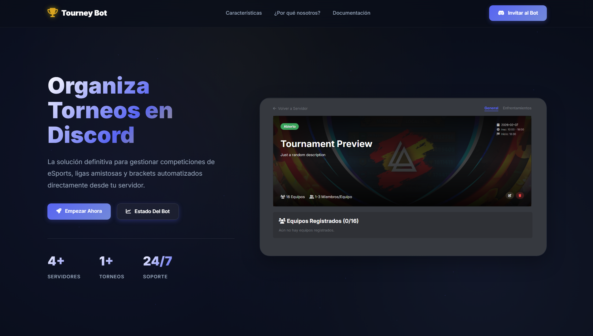

  
  <h1>Tourney Bot</h1>
  

    <b>Advanced Discord Bot for Comprehensive Tournament Management</b>
  

  

  

    <a href="https://complete-tourney.vercel.app/docs">Documentation</a>
     
    <a href="https://complete-tourney.vercel.app/">Website</a>
     
    <a href="mailto:victormnjfan@gmail.com">Contact</a>
     
  

  

  

    
    
  

  

    
    
    
  

  

  
  

  
Do you like Tourney Bot? Give it a star⭐

  
© 2026 Tourney Bot • Developed by <a href="https://victormenjon.es">Victor Menjon</a>

All rights reserved.

