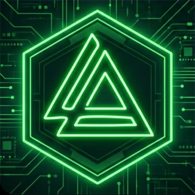
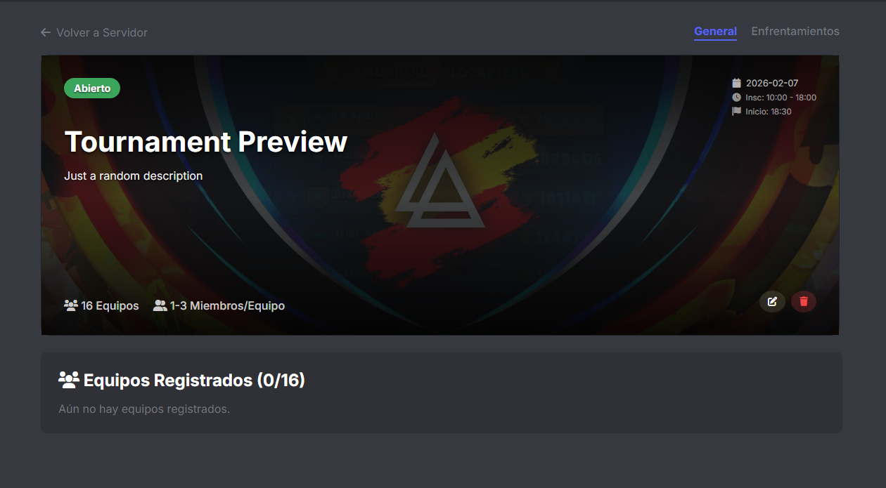

  
  <h1>Tourney Bot</h1>
  

    <b>Advanced Discord Bot for Comprehensive Tournament Management</b>
  

  

    <a href="https://tourneydoc.victormenjon.es/docs">Documentation</a> •
    <a href="https://victormenjon.es">Website</a> •
    <a href="mailto:victormnjfan@gmail.com">Contact</a>
  

  

    
  

 

<table border="0">
  <tr>
    <td width="60%" valign="middle">
      <h1 align="left">Organize Tournaments on Discord</h1>
      

        The complete solution for eSports competitions, friendly leagues, and automated brackets directly in your server.
      

      

        
        
      

    </td>
    <td width="40%" valign="middle">
      
      
<i>Modern Web Dashboard</i>

    </td>
  </tr>
</table>

 

 

  
© 2026 Tourney Bot • Developed by <a href="https://victormenjon.es">Victor Menjon</a>

All rights reserved.

